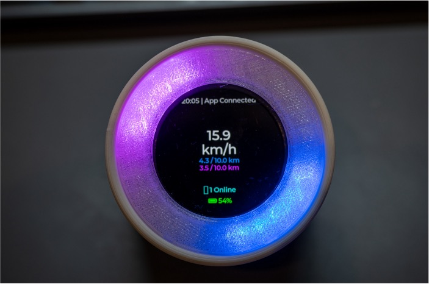
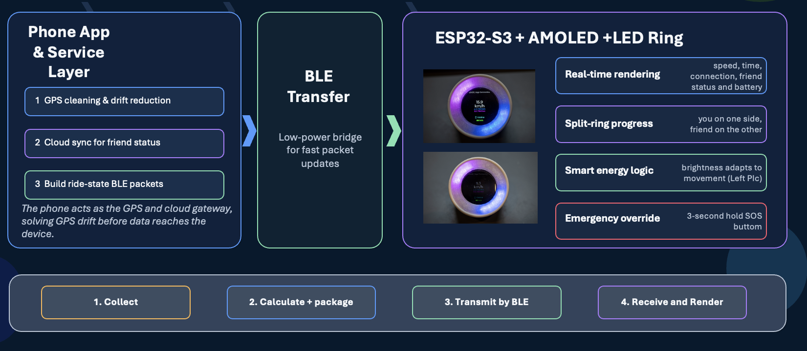

# Tether — Project Report
### CASA0021: Connected Environments — Group Prototype and Pitch

**Group:** Four Gods (Group 4)  
**Members:** Gilang Pamungkas · Haoyu Hu · Yidan Gao · Yifei Huang  
**GitHub Repository:** https://github.com/CrazyEpi/CASA0021-Tether  
**Institution:** MSc Connected Environments, UCL Bartlett Centre for Advanced Spatial Analysis, 2025–26

---

## 1. Introduction

Tether is a connected cycling system comprising a mobile application and a handlebar-mounted ambient device. Developed as part of the CASA0021 Connected Environments module, the project responds to a well-documented but underexplored design problem: the structural incompatibility between attention-intensive smartphone interfaces and the embodied, distributed demands of cycling. Tether externalises ride feedback into a bicycle-mounted ambient interface, enabling real-time awareness of performance, social comparison, and safety state without requiring riders to disengage from their physical environment.

This report documents the problem context and motivation underpinning Tether, the iterative design and development process that produced the final prototype, and a reflection on where the system sits within Connected Environments research. It also addresses production cost analysis, sustainability considerations, and the directions in which the project would be extended given further time and resources.

---

## 2. Problem Context and Research Question

The proliferation of consumer cycling technology — principally smartphone applications such as Strava and Komoot — has significantly expanded access to ride tracking, route planning, and social comparison. However, these systems are designed around a screen-interaction paradigm that assumes sedentary or low-demand contexts. Cycling imposes simultaneous demands on motor control, environmental awareness, and spatial navigation, making sustained visual engagement with a handheld device both cognitively costly and physically hazardous (Strayer & Drews, 2007).

Alternative hardware — dedicated cycling computers and smartwatches — partially mitigate smartphone dependency but replicate the same design assumption: that information density and direct visual engagement are primary values. Garmin and Wahoo devices, for instance, display rich data fields requiring deliberate focused reading, which interrupts the attentional flow of riding . This represents what Norman (2013) describes as a mismatch between the system's interaction model and the user's cognitive and physical context.

Beyond functional limitations, the social dimension of cycling is systematically underdeveloped in current platforms. Strava's social features are predominantly retrospective — kudos, segment comparisons, and activity feeds are experienced after the ride, not during it. This forecloses a class of motivational and affective interaction that could meaningfully support riders during the ride itself: awareness of a friend's concurrent progress, lightweight social presence, and shared goal pursuit (Consolvo et al., 2006).

Tether is situated within the research tradition of ubiquitous computing (Weiser, 1991) and calm technology (Weiser & Brown, 1996), which argue that the most valuable computational systems are those that recede into the periphery of attention, providing information as needed without demanding focal engagement. This tradition has informed ambient display research (Mankoff et al., 2003) and wearable computing (Gemperle et al., 1998), but has seen limited application to the specific context of cycling, where the case for peripheral, ambient feedback is especially compelling.

No existing consumer product or research prototype addresses this combination simultaneously. Ambient cycling displays such as Beeline prioritise navigation over social feedback; social platforms such as Strava are retrospective and screen-dependent; and safety-focused wearables do not integrate ride awareness or motivation. This tripartite gap — ambient feedback, concurrent social presence, and physical emergency signalling — defines the design space that Tether occupies.

The central research question is therefore: **how can a connected cycling system support real-time ride awareness, social motivation, and emergency signalling while minimising attentional disruption?** Tether operationalises this question through the integration of ambient LED feedback, a glanceable AMOLED display, and a Bluetooth Low Energy (BLE) communication layer between a handlebar-mounted device and a companion mobile application.


---

## 3. Target Users and Scenarios

Tether is designed for everyday cyclists operating in urban and peri-urban environments. Primary user groups include commuters who require situational awareness without screen engagement; recreational and fitness riders pursuing distance goals; socially connected cyclists who ride with friends and want to maintain shared awareness during the ride; and users with safety concerns who benefit from rapid emergency signalling capability.

Three core scenarios structured the design process, each grounded in an identified user need from the literature and observation:

- **Individual riding:** A commuter pairs the Tether device via BLE and sets a daily distance goal; the LED ring fills progressively as the goal is approached, providing a continuous but non-intrusive cue. This scenario responds to evidence that goal-visibility during activity contributes to sustained behaviour change (Consolvo et al., 2006).
- **Shared riding:** Two friends start a ride simultaneously; the split-ring mode divides the LED ring into two arcs — blue for the rider's own progress, purple for their friend's — enabling immediate social comparison without any screen interaction. The motivational basis for this mode draws on social facilitation principles — that awareness of a peer's concurrent effort increases individual motivation to perform.
- **Emergency context:** A rider in difficulty performs a three-second physical hold on the device button, triggering an SOS alert that is routed via BLE to the mobile application and onwards to the cloud, notifying contacts without requiring the rider to locate or unlock their phone. The three-second hold is a deliberate interaction design decision: it must be executable under physical and cognitive stress without fine motor control or screen engagement, while remaining resistant to accidental activation during normal riding.


---

## 4. Design and Development

### 4.1 Hardware Prototyping Iterations

The hardware component underwent three distinct prototype iterations, each resolving limitations identified through physical testing and user observation.

**Prototype 1 — MVP**

The initial prototype used an Arduino MKR 1010 WiFi board paired with a NeoPixel LED strip and an LC76G GPS module. This configuration was sufficient to validate the core concept — that LED-based ambient feedback could communicate ride progress meaningfully — but revealed two critical limitations. The form factor was too large for practical handlebar mounting, and the absence of battery power made field testing impossible. The reliance on WiFi rather than BLE also introduced latency and power inefficiency inappropriate for a real-time cycling interface.

**Prototype 2**

The second iteration migrated to an ESP32-S3 paired with a 1.75-inch AMOLED display, retaining the LC76G GPS and upgrading from a strip to a circular NeoPixel ring. The ring geometry was a deliberate design decision: a circular arc is readable as a proportional fill (progress) in a single glance, where a strip would require counting LEDs or parsing a numerical value. This prototype introduced speed display, GPS status feedback, and friend-count indication. However, GPS drift produced unreliable distance readings in urban canyons, and the battery capacity remained insufficient for rides exceeding 45 minutes, creating user anxiety around range.

**Current Prototype**

The final hardware design addressed both residual issues. GPS computation and drift correction was fully offloaded to the mobile phone, which acts as the GPS and cloud gateway — a significant architectural decision that simplified the embedded firmware, reduced device power consumption, and improved positional accuracy by leveraging the phone's more powerful GPS chipset and drift-correction algorithms. The device battery was upgraded to a 900mAh LiPo, and the entire assembly was housed in a custom 3D-printed enclosure designed for handlebar mounting.

### 4.2 Enclosure Design Iterations

The 3D-printed enclosure underwent four complete revision cycles. Early versions used fixed clips which were incompatible with different handlebar diameters; subsequent iterations introduced a rotary interlock mechanism for easier attachment. A friction-based screen locker was added after field testing showed the display rotating under vibration. The current version uses rubber band mounts for rapid prototyping-phase testing, prioritising field adjustability over permanent integration. The light diffuser cover remains an acknowledged weak point — the fit is not sufficiently tight, causing light bleed between LED segments in high-ambient-light conditions. A further revision with improved tolerancing and weather sealing is identified as the immediate next hardware priority.

### 4.3 Communication Architecture

The choice of Bluetooth Low Energy as the communication layer over WiFi was driven by three considerations: power efficiency (BLE consumes significantly less energy per packet than WiFi), latency characteristics (BLE notifications achieve near-zero latency for the SOS channel), and the absence of infrastructure dependency (BLE operates peer-to-peer without requiring network access).

The BLE service exposes six characteristics across a single service (`UUID: 19B10000-E8F2-537E-4F6C-D104768A1214`):

| Characteristic | Direction | Purpose |
|---|---|---|
| Live Metrics | App → ESP32 | Speed, distance, friend progress |
| Target Goal | App → ESP32 | Absolute distance goal (km) |
| Time Sync | App → ESP32 | HH:MM clock synchronisation |
| Social State | App → ESP32 | Online friend count; triggers split-ring mode |
| Social Pulse | App → ESP32 | 2-second cyan breathing animation cue |
| SOS Alert | ESP32 → App | Emergency notify, zero-latency BLE notification |

The unidirectional notify pattern for SOS — where the ESP32 pushes to the app rather than the app polling — was a deliberate safety-critical design decision, ensuring zero-latency emergency broadcast regardless of app foreground state.

### 4.4 Mobile Application Development

The companion application was built in Flutter, enabling a single codebase to target both iOS and Android while handling platform-specific BLE scanning and location permission patterns. The application integrates three live data sources during a ride: phone GPS via the geolocator package, BLE hardware telemetry, and real-time friend position data from Firebase Firestore (europe-west2 region).

The decision to use Firebase rather than a custom backend was based on its real-time synchronisation capability — Firestore's `onSnapshot` listener pattern maps naturally to the shared-ride use case, where a friend's updated distance must propagate to both the companion app and the handlebar device within seconds. The app comprises eight fully functional screens covering the full ride lifecycle: pre-ride route planning and goal setting, live tracking with BLE device connection, post-ride summary and social feed, leaderboard, and a developer console for hardware UI simulation during testing.

---

## 5. System Architecture Overview

Tether operates as a three-layer system:

```
┌─────────────────────────────────────────────────┐
│              Phone Application Layer             │
│  GPS acquisition · drift correction · BLE        │
│  packet construction · Firebase cloud sync       │
└──────────────────────┬──────────────────────────┘
                       │ BLE (6 Characteristics)
┌──────────────────────▼──────────────────────────┐
│                 ESP32-S3 Device Layer            │
│  AMOLED display: speed, time, status, battery   │
│  24-LED NeoPixel ring: goal, friend, SOS state  │
└─────────────────────────────────────────────────┘
```

The device implements three LED rendering modes:

- **Solo mode:** Single-colour arc proportional to rider's goal completion
- **Friend mode:** Split ring — blue for rider, purple for friend — direct comparative progress at a glance
- **Emergency mode:** Full-ring red override that supersedes all other LED states

An adaptive brightness algorithm dims the display at low speed to conserve battery — a power management decision that emerged from field testing in Prototype 2.

<figure>
  
  <figcaption><strong>Figure 1.</strong> Final prototype enclosure mounted on handlebars, showing the 1.75" AMOLED display and 24-LED NeoPixel ring.</figcaption>
</figure>

<figure>
  
  <figcaption><strong>Figure 2.</strong> Three-layer system architecture: phone application layer handles GPS and cloud sync; BLE transport layer transfers structured data packets; ESP32 device layer renders feedback via display and LED ring.</figcaption>
</figure>

The project GitHub repository is structured to complement rather than duplicate this report. The README covers: step-by-step hardware assembly with component wiring diagrams; ESP32 firmware flashing via Arduino IDE including all required library dependencies; Flutter application setup and deployment for both iOS and Android; and the full BLE characteristic table with UUID definitions, payload formats, and data direction. These reproducibility materials are intentionally kept separate from the analytical narrative of this report so that a reader can build and run Tether independently without reference to this document.

---

## 6. Connected Environments Research Context

Tether contributes to a body of Connected Environments research concerned with embedding computational feedback into physical activity contexts. The system's core design principle — externalising digital information into an ambient, peripheral interface — builds directly on Weiser and Brown's (1996) framework of calm technology, which distinguishes between technologies that demand centre-stage attention and those that operate at the periphery until needed.

The LED ring as an ambient display aligns with the ambient information systems literature (Mankoff et al., 2003; Pousman & Stasko, 2006), which characterises effective ambient displays as those achieving high information legibility at low attentional cost. Tether operationalises this through the arc-fill metaphor: progress is encoded spatially and proportionally, readable in a peripheral glance without numerical parsing.

The social comparison layer connects to research on persuasive technology and social fitness motivation. Consolvo et al. (2006) demonstrated that real-time awareness of peers' activity significantly increased physical activity in field trials. Tether's split-ring friend mode applies this principle specifically to concurrent cycling, where the motivational effect of social comparison is most immediate. The shared-ride synchronisation via Firebase extends this into a form of lightweight social presence (Brave & Dahley, 1997), where two physically separated riders maintain awareness of each other's progress without communication overhead.

The SOS functionality situates Tether within emerging research on safety-critical wearables and IoT emergency systems. The three-second physical hold pattern balances accidental trigger prevention against speed of activation — a deliberate interaction design decision that prioritises operability under stress over interaction efficiency.

---

## 7. Production Costs and Sustainability

### 7.1 Component Costs

The current prototype's direct component cost is **£64.30 per unit**:

| Component | Unit Cost |
|---|---|
| Waveshare ESP32-S3-Touch-AMOLED-1.75 | £38.00 |
| 24-pixel NeoPixel LED Ring | £16.20 |
| 1000mAh 3.7V LiPo Battery | £8.00 |
| 1.25mm 2-pin Cable | £0.90 |
| 3D-Printed Enclosure | £1.20 |
| **Total Direct Cost** | **£64.30** |

At mass production scale, with distribution (£10), allocated employee cost (£15), marketing and research (£8), and cloud and operations (£8) factored in, the **total cost per unit rises to £104.30**.

The suggested retail price of **£149** positions Tether competitively against the Beeline Velo 2 (£99.99) while offering differentiated social and safety functionality. At this margin:

- **Breakeven point:** ~17 months
- **Year 1 target:** 1,200 units
- **Year 3 net profit:** ~£367,400 (at 7,000 units)
- **Subscription tier:** £5/month for premium social features

### 7.2 Sustainability Considerations

The sustainability profile of Tether is shaped by several design decisions:

- **BLE communication** significantly reduces device power consumption relative to WiFi or cellular alternatives, extending battery life per charge cycle and reducing total energy consumption over the product's lifetime.
- **GPS offloading to phone** eliminates a second GPS chipset from the device, reducing both manufacturing complexity and electronic waste volume.
- **PLA enclosure** is biodegradable under industrial composting conditions, representing a more sustainable enclosure material than injection-moulded ABS.
- **Repairability gap:** The current enclosure is not designed for easy disassembly, limiting component recovery at end of life. A production version would redesign for modular disassembly, allowing the ESP32 and LED ring to be replaced independently.
- **Battery impact:** The LiPo battery carries the greatest environmental impact in manufacturing (cobalt and lithium extraction) and disposal. A production version would integrate a battery replacement programme and partner with certified e-waste processors.
- **Cloud infrastructure:** Firebase runs on Google's data centres, which have committed to operating on 24/7 carbon-free energy by 2030, partially mitigating the operational carbon footprint.

---

## 8. Competitive Positioning

Tether's closest commercial comparator is the **Beeline Velo 2** (£99.99):

| Dimension | Tether | Beeline Velo 2 |
|---|---|---|
| Core focus | Social motivation + ambient safety | Navigation-first cycling computer |
| Feedback method | 1.75" AMOLED + 24-LED ring | Compact glanceable display |
| Social features | Real-time friend progress, split-ring | Post-ride only |
| Safety | SOS alert + red LED override | Audio guidance |
| Price target | £149 | £99.99 |
| Battery/durability | 900mAh, needs improvement | Weatherproof, 11-hour battery |

Tether's competitive edge lies in its social and safety differentiation within the same price bracket. The gap in battery durability and weather resistance is acknowledged and represents the primary hardware engineering priority for a production version.

---

## 9. Future Work

Given additional time and resources, Tether would be developed along four principal vectors:

**Hardware integration and durability**  
The current reliance on the phone for GPS and cloud connectivity is an architectural compromise that reduces device independence. A future iteration would integrate a low-power GPS chipset directly into the device and add a cellular module (e-SIM) for standalone operation, enabling SOS alerts even when the phone is out of BLE range. The enclosure would be redesigned to achieve IP65 weather resistance and pass handlebar vibration testing standards.

**Energy autonomy**  
The 900mAh battery is insufficient for rides exceeding approximately three hours. A production device would target a 2,000–3,000mAh cell with solar-assisted top-up via a thin-film panel integrated into the enclosure lid (Dong et al., 2021). The adaptive brightness algorithm would be extended with an accelerometer-based motion detector to modulate display state more precisely.

**Expanded social features**  
The current friend-mode supports one-to-one comparison. A group ride mode supporting up to five simultaneous riders would be developed, with segment-based LED allocation encoding each rider's relative position within the group. Integration with Strava's API would allow existing social graphs to be imported without requiring separate account creation.

**Safety expansion**  
The SOS system would be extended with automatic crash detection using the ESP32's onboard accelerometer, triggering an alert after an impact event with a 10-second cancellation window to prevent false positives. Integration with emergency services APIs (999/112) would be explored subject to regulatory review.

---

## 10. Conclusion

Tether demonstrates a viable, principled approach to the challenge of ambient information delivery in high-demand physical activity contexts. By grounding the design in ubiquitous computing theory and calm technology principles, and by iterating through three hardware prototypes and four enclosure revisions, the project has produced a functional connected cycling system that meaningfully reduces smartphone dependency while introducing novel social and safety capabilities not present in existing commercial devices.

The system goes beyond the immediate scope of the module by integrating real-time cloud synchronisation, a production-grade Flutter application, custom BLE firmware, and a viable commercial model with quantified cost and revenue projections. While current limitations in battery life, weather resistance, and enclosure fit are acknowledged, these represent engineering refinement challenges rather than fundamental design flaws. The architectural decisions underpinning Tether — ambient feedback, phone-as-gateway, BLE for real-time safety signalling — are validated by the prototype and provide a sound foundation for continued development.

---

## 11. References

Brave, S. & Dahley, A. (1997) 'inTouch: a medium for haptic interpersonal communication', in *CHI '97 Extended Abstracts*. New York: ACM, pp. 363–364.

Consolvo, S., Everitt, K., Smith, I. & Landay, J.A. (2006) 'Design requirements for technologies that encourage physical activity', in *Proceedings of CHI 2006*. New York: ACM, pp. 457–466.


Dong, B., Shi, Q., Yang, Y., Wen, F., Zhang, Z. & Lee, C. (2021) 'Technology evolution from self-powered sensors to AIoT enabled smart homes', *Nano Energy*, 79, p. 105414.

Gemperle, F., Kasabach, C., Stivoric, J., Bauer, M. & Martin, R. (1998) 'Design for wearability', in *Proceedings of the Second International Symposium on Wearable Computers*. New York: IEEE, pp. 116–122.

Mankoff, J., Dey, A.K., Hsieh, G., Kientz, J., Lederer, S. & Ames, M. (2003) 'Heuristic evaluation of ambient displays', in *Proceedings of CHI 2003*. New York: ACM, pp. 169–176.

Norman, D.A. (2013) *The Design of Everyday Things*. Revised edn. New York: Basic Books.

Pousman, Z. & Stasko, J. (2006) 'A taxonomy of ambient information systems: four patterns of design', in *Proceedings of AVI 2006*. New York: ACM, pp. 67–74.


Strayer, D.L. & Drews, F.A. (2007) 'Cell-phone-induced driver distraction', *Current Directions in Psychological Science*, 16(3), pp. 128–131.

Weiser, M. (1991) 'The computer for the 21st century', *Scientific American*, 265(3), pp. 94–104.

Weiser, M. & Brown, J.S. (1996) 'Designing calm technology', *PowerGrid Journal*, 1(1), pp. 75–85.